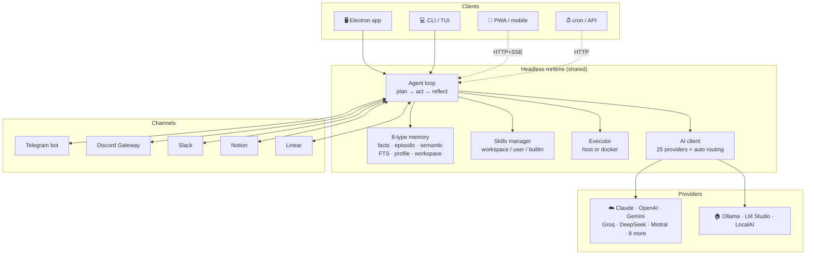

<p align="center">
  
</p>

<h1 align="center">Horizon AI</h1>

<p align="center">
  <strong>The personal AI agent that runs on <em>your</em> machine.</strong><br/>
  <sub>Desktop app · Terminal CLI · Headless HTTP API · Mobile (soon)</sub>
</p>

<p align="center">
  <a href="https://github.com/ErnestKostevich/horizon-genesis/releases/latest"></a>
  <a href="https://github.com/ErnestKostevich/horizon-genesis/actions/workflows/release.yml"></a>
  <a href="https://github.com/ErnestKostevich/horizon-genesis/releases"></a>
  <a href="https://github.com/ErnestKostevich/horizon-genesis/stargazers"></a>
  <a href="LICENSE"></a>
  <a href="https://horizonaai.dev"></a>
</p>

<p align="center">
  <a href="#install">Install</a> ·
  <a href="#what-it-does">Features</a> ·
  <a href="#vs-hermes-vs-openclaw">Comparison</a> ·
  <a href="https://github.com/ErnestKostevich/Horizon-Agent-Docs">User Docs</a> ·
  <a href="https://horizonaai.dev/docs">Hosted Docs</a>
</p>

---

> Bring your own model (Claude / GPT / Gemini / Groq / DeepSeek / Mistral / 19 more,
> or fully local with Ollama). Bring your own ethics — every shell command, file
> write, and message send goes through a permission gate. Bring your own data —
> memory and keys never leave your machine.

<p align="center">
  <em>Want to use Horizon? Start at the <a href="https://github.com/ErnestKostevich/Horizon-Agent-Docs">User Docs</a> or <a href="https://github.com/ErnestKostevich/horizon-genesis/releases/latest">download the latest release</a>. This README is the source-code overview.</em>
</p>

## What it does

- **Desktop GUI** with real-time chat, persona switching, plugin marketplace,
  computer-use vision (the agent can see your screen, click, type, take
  screenshots), wake word, continuous talk mode, and an inspector that
  shows every step the agent plans + executes.
- **Terminal CLI + TUI** that share the same memory, skills, and persona as
  the desktop app. Streaming chat, markdown rendering, gradient spinner,
  slash commands, full agent loop with live step rail.
- **Headless HTTP API** so cron jobs, mobile clients, and remote machines
  can drive the same agent over JSON + Server-Sent Events.
- **25 AI providers + 300+ models via OpenRouter** — Claude, OpenAI,
  Gemini, Groq, DeepSeek, Mistral, Qwen, Perplexity, Cohere, Grok,
  Together AI, Fireworks, DeepInfra, Cerebras, SambaNova, Moonshot Kimi,
  Z.AI/GLM, Nebius, OpenRouter aggregator, Azure OpenAI, custom
  OpenAI-compatible endpoint, plus local Ollama / LM Studio / LocalAI.
- **8-type memory** — facts, episodic memories, conversations, semantic
  recall (256-dim embeddings), FTS index, user profile (Big-Five model),
  persona memory, and per-workspace `.horizon/memory.json` that you commit
  alongside the code it describes.
- **Skills system** with three scopes (workspace / user / builtin) — same
  SKILL.md format Anthropic uses. Auto-pickup based on the user's query.
- **Plugin SDK** in TypeScript with a CLI scaffolder
  ([`horizon-plugin-sdk`](https://github.com/ErnestKostevich/horizon-plugin-sdk)) +
  a real **marketplace** with crypto payouts to authors via NOWPayments.

## Install

### Desktop app (Electron — Windows / macOS / Linux)

Grab the official installer from
[the latest release](https://github.com/ErnestKostevich/horizon-genesis/releases/latest):

| Platform | File |
|---|---|
| Windows x64 (installer) | `Horizon-AI-Setup-x.y.z.exe` |
| Windows x64 (portable)  | `Horizon-AI-Portable-x.y.z.exe` |
| macOS (Intel + Apple Silicon) | `Horizon-AI-x.y.z.dmg` |
| Linux x64 (AppImage)    | `Horizon-AI-x.y.z.AppImage` |
| Linux x64 (Debian/Ubuntu) | `horizon-ai_x.y.z_amd64.deb` |

### Terminal CLI (standalone — no Node.js required)

```bash
# macOS / Linux
curl -L https://github.com/ErnestKostevich/horizon-genesis/releases/latest/download/horizon-linux-x64 -o /usr/local/bin/horizon
chmod +x /usr/local/bin/horizon
horizon setup
```

```powershell
# Windows
iwr https://github.com/ErnestKostevich/horizon-genesis/releases/latest/download/horizon-win-x64.exe -OutFile horizon.exe
.\horizon.exe setup
```

### CLI from source (if you have Node 22+)

```bash
curl -fsSL https://raw.githubusercontent.com/ErnestKostevich/horizon-genesis/main/scripts/install-cli.sh | bash      # Linux/macOS
iwr https://raw.githubusercontent.com/ErnestKostevich/horizon-genesis/main/scripts/install-cli.ps1 | iex             # Windows
```

## Quick taste

```bash
# First-time setup — interactive wizard picks provider, key, persona, lang
horizon setup

# One-shot tasks
horizon "find every TODO in this repo and group them by file"
horizon chat "summarise this article" --quiet < article.txt
horizon agent "draft a PR description for the last 3 commits" --auto-approve

# Smart routing — pick the cheapest usable provider per call
horizon chat "what's 2+2?" --provider auto       # → Gemini-Flash (free tier)
horizon agent "do something hard" --provider auto # → bigger model if needed

# See what you've spent
horizon cost                                      # last 30 days
horizon cost --days 7 --json                      # weekly breakdown

# Launch the polished TUI
horizon

# Headless server (for PWA / cron / VPS)
horizon serve --port 18789 --token mysecret
```

### Server-agent mode (Hermes-style, all-in-one)

The same binary runs as a 24/7 server agent. Deploy on a VPS, enable the
messaging channels you want, and the agent answers from Telegram /
Discord / Slack / WhatsApp / Signal / iMessage / Email without a desktop
in the loop:

```bash
# On the VPS — install the CLI binary, set your keys, then:
horizon serve \
  --port 18789 \
  --token $HORIZON_TOKEN \
  --enable-telegram \
  --enable-discord \
  --enable-email

# Now message your Telegram bot, mention it in Discord, or email it —
# the agent loop runs on the server, uses your provider keys, and the
# memory file lives next to it.
```

Same agent, same memory, same skills the desktop app uses — just no
window. You can still hit the HTTP API from your laptop, point a PWA
at it, or schedule cron jobs against it.

## vs Hermes vs OpenClaw

|  | **Horizon AI** | Hermes Agent | OpenClaw |
|---|:---:|:---:|:---:|
| **License** | BUSL-1.1 (source-visible) | MIT | MIT |
| Desktop GUI app           | ✅ Full Electron | ❌ | 🔸 Web Control UI |
| Terminal CLI              | ✅ | ✅ | ✅ |
| Polished TUI              | ✅ gradient banner | ✅ | 🔸 |
| Token-streaming output    | ✅ | ✅ | ✅ |
| Markdown render in TUI    | ✅ | 🔸 | 🔸 |
| Headless HTTP + SSE       | ✅ | 🔸 | ✅ |
| Mobile companion          | 🔸 PWA Q3 | ❌ | ✅ iOS + Android |
| **AI providers**          | **25** direct + OpenRouter (300+) | 200+ via wrapper | 50+ via wrapper |
| Smart auto routing        | ✅ `--provider auto` (free/local first) | ❌ | ❌ |
| Cost tracking + budget    | ✅ `horizon cost` | ❌ | ❌ |
| Setup wizard              | ✅ | ✅ | 🔸 |
| BYOK encrypted storage    | ✅ AES-256-GCM | ✅ | ✅ |
| Local-first (Ollama)      | ✅ | ✅ | ✅ |
| **Memory storage**        | JSON + SQLite + FTS5 + embeddings (hybrid) | SQLite + FTS5 | JSON |
| 8-type memory model       | ✅ | 🔸 4 types | 🔸 |
| Workspace-bound memory    | ✅ `.horizon/memory.json` | ❌ | ❌ |
| Semantic recall           | ✅ 256-dim | ✅ | 🔸 |
| User Profile (Big-Five)   | ✅ | 🔸 | ❌ |
| **Skills system**         | ✅ 3 scopes | ✅ | ✅ |
| SKILL.md format           | ✅ Anthropic-compat | ✅ agentskills.io | own |
| Auto skill suggestion     | ✅ | ✅ | ❌ |
| **Personas**              | ✅ 5 built-in + custom | ❌ | ❌ |
| **Tools**                 | 50+ | 70+ | ~20 |
| MCP server support        | ✅ | ❌ | ❌ |
| Subagents (parallel)      | ✅ `spawn_subagent` | ✅ | ❌ |
| **Sandbox backends**      | host + Docker + SSH + Modal + Daytona + **Singularity** | host/docker/SSH/Daytona/Singularity/Modal | host + docker |
| Computer use (vision)     | ✅ wake/click/screenshot | ❌ | 🔸 |
| Wake word                 | ✅ Deepgram + Groq | ❌ | ✅ |
| Continuous talk mode      | ✅ | ❌ | ✅ |
| **Channels**              | 7 (TG / Discord / Slack / WhatsApp / Signal / iMessage / Email) | 20+ | 10+ (WhatsApp/iMessage/Signal/Teams/...) |
| Telegram bot runtime      | ✅ | ✅ | ✅ |
| Discord Gateway WS        | ✅ | ✅ | ✅ |
| Cron-driven workflows     | ✅ `workflowEngine` | ✅ | ❌ |
| **Plugin SDK**            | ✅ TypeScript + CLI | 🔸 | 🔸 |
| **Marketplace**           | ✅ NOWPayments (crypto-only by design) | 🔸 Skills Hub (free) | 🔸 ClawHub (free) |
| Crypto payouts to authors | ✅ USDT TRC20/BSC/TON/SOL · 70/30 split | ❌ | ❌ |
| Standalone CLI binaries   | ✅ 4 platforms | ✅ | ✅ |

> Legend: ✅ first-class · 🔸 partial / planned · ❌ not present

## Architecture



One headless runtime drives every client. Memory and keys live on your
machine — the desktop app, CLI, and HTTP API all read/write the same
`%APPDATA%/horizon-ai/` (or `~/Library/Application Support/horizon-ai/`,
or `~/.config/horizon-ai/`). Set up once in the GUI, use the CLI from any
shell, expose to mobile via `horizon serve`.

## Memory model

8 layers of context across short-, mid-, and long-term:

| Layer | Where | What |
|---|---|---|
| **Facts** | `horizon_memory.json` | Stable key/value preferences (name, location, project conventions) |
| **Episodic memories** | `horizon_memory.json` | Time-stamped events ("user said Yerba mate tastes like grass on 2026-04-12") |
| **Conversations** | `horizon_memory.json` | Last N user/assistant turns, FTS-indexed |
| **Semantic embeddings** | `horizon_embeddings.json` | 256-dim vectors (OpenAI 3-small or Gemini), cosine recall |
| **FTS index** | in-memory (pure JS InvertedIndex) + `memory.sqlite` mirror (FTS5) | Token-level keyword recall, TF-IDF + positional. SQLite mirror rebuilt automatically on boot — gives you phrase/prefix/proximity queries on top of the in-memory index. |
| **User Profile** | `horizon_memory.json → userProfile` | Big-Five trait model + communication style, auto-updated |
| **Persona memory** | `horizon_memory.json → personaMemory.<id>` | Per-persona note buffer |
| **Workspace memory** | `<repo>/.horizon/memory.json` | Conventions, glossary, decisions, do-not list — commit in git |

The agent's reasoning prompt receives a relevance-scored slice of all 8
on every turn. Total context budget ~12 KB per call, automatically
trimmed to fit smaller models.

## Skills

SKILL.md bundles in three scopes, picked up by relevance score:

```
workspace      <repo>/.horizon/skills/<id>/SKILL.md         ← per-project, commit in git
user           <userData>/skills/<id>/SKILL.md              ← global to you
builtin        builtin-skills/<id>/SKILL.md                 ← ships with Horizon
```

Each is a YAML-frontmatter markdown file:

```markdown
---
name: refactor-react
description: Migrate React class components to function components with hooks
version: 0.2.0
tags: [react, refactor, hooks]
triggers: [class component, componentDidMount, setState in class]
---

# Refactor React class → function with hooks

Step 1: ...
Step 2: ...
```

The agent auto-includes the most relevant skills in its system prompt
based on the user's query. Browse, install, edit, or publish via the
marketplace or `horizon skill list` / `horizon skill new <id>`.

## Plugins

TypeScript SDK with a CLI scaffolder — see
[`horizon-plugin-sdk`](https://github.com/ErnestKostevich/horizon-plugin-sdk).

```bash
npx hz-plugin init my-plugin
cd my-plugin
npm run dev
npx hz-plugin publish
```

Manifest declares permissions; the user approves on install. Plugins
get their own tools that the agent can call.

## Documentation

| | |
|---|---|
| [Getting Started](docs/getting-started.md) | User-facing intro for the desktop app + CLI |
| [CLI / TUI / serve reference](docs/cli.md) | Every subcommand, flag, output format |
| [VPS deployment](docs/deploy.md) | systemd + nginx + TLS + cron |
| [Competitive analysis](docs/competitive-analysis.md) | Honest by-feature comparison vs Hermes Agent |
| Hosted docs site | https://horizonaai.dev/docs |
| Plugin SDK | https://github.com/ErnestKostevich/horizon-plugin-sdk |

## Roadmap

- [x] Electron desktop app (Windows / macOS / Linux installers)
- [x] 8-type memory + semantic recall
- [x] Skills system with 3 scopes + Anthropic-compatible SKILL.md
- [x] Plugin SDK + NOWPayments crypto-only marketplace (USDT TRC20/BSC/TON/SOL)
- [x] Bidirectional Telegram + Discord bots
- [x] Docker executor backend
- [x] Subagents (`spawn_subagent` tool)
- [x] Computer use (vision + click + screenshot + wake word)
- [x] Continuous Talk Mode
- [x] CLI + TUI with streaming, markdown, gradient spinner
- [x] Headless HTTP API with SSE
- [x] Standalone binaries for win/mac/linux
- [x] `horizon setup` onboarding wizard
- [x] `horizon cost` token tracking + `--provider auto` routing
- [x] TUI v2 — multi-line composer, in-chat search, scrollback, mouse
- [x] Vision-on-turn-1 — auto-screenshot when task mentions the screen
- [x] SSH + Modal + Daytona executors (BYOK)
- [x] Agent Mode boost — visible "AGENT IN CONTROL" banner + consent gate
- [x] 50+ CLI subcommands across 5 groups
- [x] Mobile PWA companion app — QR-pair, lives in `mobile/`
- [ ] MCP servers spawnable from CLI (config exists, process spawn next)
- [ ] WhatsApp / Signal / iMessage adapters
- [ ] Plugin SDK v2 with Rust/WASM support

See [`docs/cli-plan.md`](docs/cli-plan.md) for the detailed phase-by-phase
design that drives the CLI tracks.

## File locations

| File | What it stores |
|---|---|
| `<userData>/horizon-settings.json` | provider, model, persona, lang, prefs |
| `<userData>/horizon-keys.json` | API keys (AES-256-GCM, machine-id bound) |
| `<userData>/horizon_memory.json` | 8-type memory (everything except embeddings) |
| `<userData>/horizon_embeddings.json` | semantic embedding sidecar |
| `<userData>/horizon-cost.jsonl` | per-call cost log |
| `<userData>/skills/<id>/` | user-installed skills |
| `<userData>/plugins/<id>/` | installed plugins |
| `<workspace>/.horizon/memory.json` | workspace-bound memory (commit in git) |
| `<workspace>/.horizon/skills/<id>/` | workspace-scoped skills (commit in git) |
| `<workspace>/.horizon/rules.md` | per-project rules injected into every prompt |

`<userData>` resolves to:

- Windows: `%APPDATA%\horizon-ai\`
- macOS:   `~/Library/Application Support/horizon-ai/`
- Linux:   `~/.config/horizon-ai/`

## Why BUSL-1.1?

Hermes and OpenClaw ship under MIT. Horizon ships under
Business Source License 1.1 — source-visible, free for personal /
educational / internal-evaluation use; commercial deployments need a
written licence agreement with the author.

- **Free for evaluation, personal use, and contributing back.** Run
  it on your own machine, audit the source, send PRs.
- **Commercial resale of Horizon itself** (hosted service, paid
  redistribution) requires a licence. Building plugins / workflows
  on top of Horizon and selling them through the marketplace is
  fully supported and does not require a separate licence.
- Same pattern HashiCorp's Terraform Enterprise, Sentry, and
  Mattermost use.

Reach out to Ernest at the address in [`SECURITY.md`](SECURITY.md) for
commercial questions.

<details>
<summary><strong>Repo layout</strong> (click to expand — for contributors and curious readers)</summary>

```
src/main/              Electron main process — IPC, plugin runtime, providers
src/main/runtime/      Headless runtime (shared by CLI/TUI/serve)
src/main/channels/     Messaging adapters (telegram/discord/whatsapp/signal/imessage)
src/renderer/          Electron chat UI, settings, voice
bin/                   CLI + TUI + HTTP serve entry points
bin/lib/               argv parser, ANSI helpers, banner, markdown, commands
builtin-skills/        SKILL.md bundles that ship with the app
builtin-plugins/       Plugins that ship with the app
mobile/                PWA companion (served by horizon-serve)
test/                  node --test unit + integration tests
docs/                  Technical / contributor docs (CLI ref, deploy guide, …)
scripts/               install-cli.{sh,ps1}, icon generator
.github/workflows/     CI workflows
```

User-facing documentation lives in a separate repo: [Horizon-Agent-Docs](https://github.com/ErnestKostevich/Horizon-Agent-Docs).

</details>

## Contributing

Small fixes welcome. Open an issue first for anything non-trivial.
See [CONTRIBUTING.md](CONTRIBUTING.md).

## Security

Found a vulnerability? Please don't open a public issue.
See [SECURITY.md](SECURITY.md).

## Author

Built by [Ernest Kostevich](https://github.com/ErnestKostevich) ·
[horizonaai.dev](https://horizonaai.dev) ·
ernest2011kostevich@gmail.com

If you find Horizon useful, the easiest support is a ⭐ on this repo and
a follow on the marketplace.
